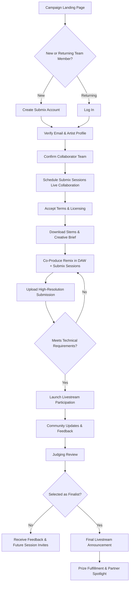

# Submix x PreSonus Remix Competition User Flow

The flow below highlights the collaborative path entrants follow for the Submix x PreSonus activation around Marie Vaunt’s "The Chosen."

## Key Interaction Notes
- **Collaborator Confirmation** ensures every submission represents at least two contributors and documents their roles.
- **Submix Sessions Scheduling** keeps the live collaboration platform central to the contest experience.
- **High-Resolution Delivery** accepts WAV, AIFF, FLAC, or comparable formats to maintain audio fidelity for review.
- **Launch and Finale Livestreams** frame the campaign kickoff on November 17 and the winner reveal on December 18.
